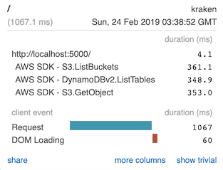

# NormDev.MiniProfiler.AWS

An unofficial package to add AWS service calls to [MiniProfiler](https://github.com/MiniProfiler/dotnet) traces. **Do not report issues with this library on AWS repositories.**




## Enabling for ASP.NET Core applications

To enable MiniProfiler in an ASP.NET Core application follow this tutorial https://miniprofiler.com/dotnet/AspDotNetCore


To add AWS service calls to the trace add a call to `AddAWSSDK` after calling `AddMiniProfiler`

```csharp
public void ConfigureServices(IServiceCollection services)
{
    ...

    services
        .AddMiniProfiler()
        .AddAwsSdk();

    ...
}
```

## Enable in Non-DI applications

For applications that are **not using Microsoft.Extensions.DependencyInjection** to enable MiniProfiler the `Register.RegisterWithSdk()` is used.

```charp
NormDev.MiniProfiler.AWS.Register.RegisterWithSdk()
```

